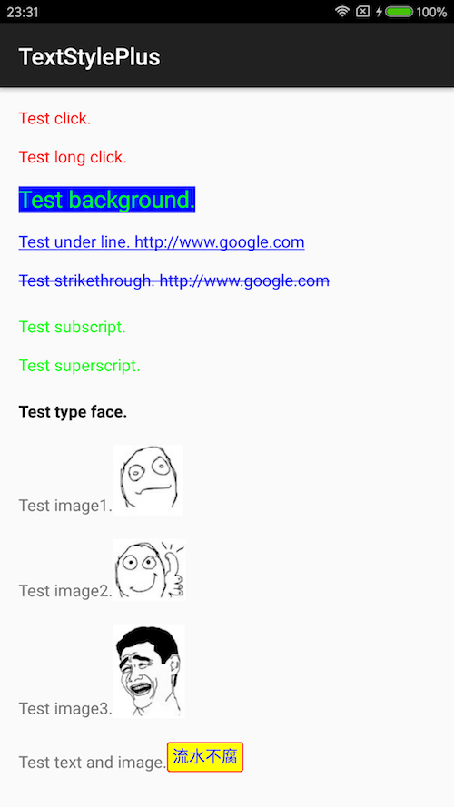
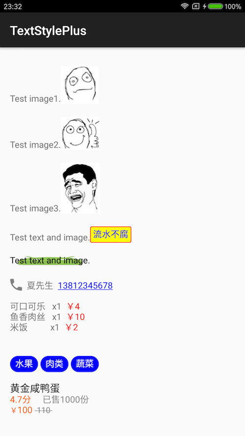

# TextStylePlus

--- 

Android textview style

Ii's like [BabushkaText](https://github.com/quiqueqs/BabushkaText) or [Android-TextView-LinkBuilder](https://github.com/klinker24/Android-TextView-LinkBuilder)

# Gradle

[](https://jitpack.io/#LiushuiXiaoxia/TextStylePlus)

[](https://travis-ci.org/LiushuiXiaoxia/TextStylePlus)
 
**Step 1. Add the JitPack repository to your build file**

Add it in your root build.gradle at the end of repositories:

```sh
allprojects {
    repositories {
        maven { url 'https://jitpack.io' }
    }
}
```

**Step 2. Add the dependency**

```sh
dependencies {
    compile 'com.github.LiushuiXiaoxia:TextStylePlus:v0.2'
}
```

# Demo




```java
public class MainActivity extends AppCompatActivity {

    @Override
    protected void onCreate(Bundle savedInstanceState) {
        super.onCreate(savedInstanceState);
        setContentView(R.layout.activity_main);


        TextView textView = (TextView) findViewById(R.id.textview);


        int textColor = Color.parseColor("#ff6000");
        new StyleBuilder()
                .addTextStyle("Test click.").textColor(Color.parseColor("#ff0000"))
                .click(new ClickListener() {
                    @Override
                    public void click(String text) {
                        Toast.makeText(MainActivity.this, "click", Toast.LENGTH_SHORT).show();
                    }
                })
                .commit().newLine().newLine()

                .addTextStyle("Test long click.").textColor(Color.parseColor("#ff0000"))
                .longClick(new LongClickListener() {
                    @Override
                    public void longClick(String text) {
                        Toast.makeText(MainActivity.this, "longClick", Toast.LENGTH_SHORT).show();
                    }
                })
                .commit().newLine().newLine()

                .addTextStyle("Test background.").textColor(Color.GREEN).backgroundColor(Color.BLUE)
                .textSize(Utils.dip2px(this, 20))
                .longClick(new LongClickListener() {
                    @Override
                    public void longClick(String text) {
                        Toast.makeText(MainActivity.this, "longClick", Toast.LENGTH_SHORT).show();
                    }
                })
                .commit().newLine().newLine()

                .addTextStyle("Test under line. http://www.google.com").underLined(true).textColor(Color.BLUE)
                .commit().newLine().newLine()

                .addTextStyle("Test strikethrough. http://www.google.com").strikethrough(true).textColor(Color.BLUE)
                .commit().newLine().newLine()

                .addTextStyle("Test subscript.").subscript(true).textColor(Color.GREEN)
                .commit().newLine().newLine()

                .addTextStyle("Test superscript.").superscript(true).textColor(Color.GREEN)
                .commit().newLine().newLine()

                .addTextStyle("Test type face.").typeFaceStyle(Typeface.BOLD).textColor(Color.BLACK)
                .commit().newLine().newLine()

                .text("Test image1.")
                .addTextStyle("image").iconRes(R.drawable.ic1)
                .commit().newLine().newLine()

                .text("Test image2.")
                .addTextStyle("image").iconDrawable(getResources().getDrawable(R.drawable.ic2))
                .commit().newLine().newLine()

                .text("Test image3.")
                .addTextStyle("image").iconBitmap(BitmapFactory.decodeResource(getResources(), R.drawable.ic3))
                .commit().newLine().newLine()

                .text("Test text and image.")
                .addImageStyle("流水不腐").imageRes(R.drawable.image_drawable).textColor(Color.BLUE)
                .commit().newLine().newLine()

                .addImageStyle("Test text and image.").imageRes(R.drawable.ic_launcher).textColor(Color.BLACK)
                .commit().newLine().newLine()

                .addTextStyle("call").iconRes(R.drawable.ic_call).commit()
                .text("  夏先生  ")
                .addTextStyle("13812345678").underLined(true).textColor(Color.BLUE)
                .commit()
                .newLine().newLine()

                .text("可口可乐   x1 ").addTextStyle(" ￥4").textColor(Color.RED).commit().newLine()
                .text("鱼香肉丝   x1 ").addTextStyle(" ￥10").textColor(Color.RED).commit().newLine()
                .text("米饭          x1 ").addTextStyle(" ￥2").textColor(Color.RED).commit().newLine()
                .newLine().newLine()

                .addImageStyle(" 水果 ").imageRes(R.drawable.tag_bg).textColor(Color.WHITE).commit()
                .text(" ")
                .addImageStyle(" 肉类 ").imageRes(R.drawable.tag_bg).textColor(Color.WHITE).commit()
                .text(" ")
                .addImageStyle(" 蔬菜 ").imageRes(R.drawable.tag_bg).textColor(Color.WHITE).commit()
                .newLine().newLine()


                .addTextStyle("黄金咸鸭蛋").textSize(Utils.dip2px(this, 16)).textColor(Color.BLACK).commit().newLine()
                .addTextStyle("4.7分").textColor(textColor).commit()
                .addTextStyle("     已售1000份").textColor(Color.GRAY).commit().newLine()
                .addTextStyle("￥").textSize(Utils.dip2px(this, 12)).textColor(textColor).commit()
                .addTextStyle("100 ").textSize(Utils.dip2px(this, 14)).textColor(textColor).commit()
                .addTextStyle(" 110 ").textSize(Utils.dip2px(this, 13)).strikethrough(true).textColor(Color.GRAY)
                .commit().newLine()


                .show(textView);

    }
}
```