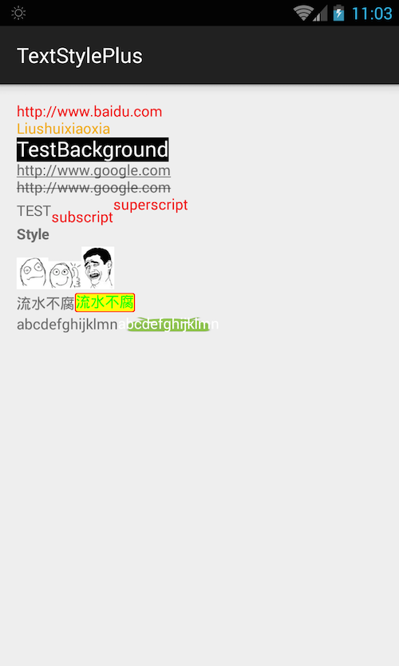

# TextStylePlus
android textview style

Ii's like [BabushkaText](https://github.com/quiqueqs/BabushkaText) or [Android-TextView-LinkBuilder](https://github.com/klinker24/Android-TextView-LinkBuilder)
# Demo

```
public class MainActivity extends AppCompatActivity {

    @Override
    protected void onCreate(Bundle savedInstanceState) {
        super.onCreate(savedInstanceState);
        setContentView(R.layout.activity_main);


        TextView textView = (TextView) findViewById(R.id.textview);

        TextStyleItem one = new TextStyleItem("http://www.baidu.com")
                .setTextColor(Color.parseColor("#f00f0f"))
                .setClickListener(new TextStyleItem.OnClickListener() {
                    @Override
                    public void onClick(String clickedText) {
                        Toast.makeText(MainActivity.this, "onClick", Toast.LENGTH_SHORT).show();
                    }
                });


        TextStyleItem two = new TextStyleItem("Liushuixiaoxia")
                .setTextColor(Color.parseColor("#f0aa0f"))
                .setLongClickListener(new TextStyleItem.OnLongClickListener() {
                    @Override
                    public void onLongClick(String clickedText) {
                        Toast.makeText(MainActivity.this, "onLongClick", Toast.LENGTH_SHORT).show();
                    }
                });

        TextStyleItem three = new TextStyleItem("TestBackground")
                .setTextColor(Color.WHITE)
                .setBackgroundColor(Color.BLACK)
                .setTextSize(Utils.dip2px(this, 20))
                .setLongClickListener(new TextStyleItem.OnLongClickListener() {
                    @Override
                    public void onLongClick(String clickedText) {
                        Toast.makeText(MainActivity.this, "onLongClick", Toast.LENGTH_SHORT).show();
                    }
                });

        new StyleBuilder()
                .addStyleItem(one)
                .newLine()
                .addStyleItem(two)
                .newLine()
                .addStyleItem(three)
                .newLine()
                .addStyleItem(new TextStyleItem("http://www.google.com").setUnderLined(true))
                .newLine()
                .addStyleItem(new TextStyleItem("http://www.google.com").setStrikethrough(true))
                .newLine()
                .text("TEST")
                .addStyleItem(
                        new TextStyleItem("subscript")
                                .setSubscript(true)
                                .setTextColor(Color.parseColor("#f00f0f"))
                )
                .addStyleItem(
                        new TextStyleItem("superscript")
                                .setSuperscript(true)
                                .setTextColor(Color.parseColor("#f00f0f"))
                )
                .newLine()
                .addStyleItem(new TextStyleItem("Style").setTypeFaceStyle(Typeface.BOLD))
                .newLine()
                .addStyleItem(new TextStyleItem("image").setIconRes(R.drawable.ic1))
                .addStyleItem(new TextStyleItem("image").setIconDrawable(getResources().getDrawable(R.drawable.ic2)))
                .addStyleItem(
                        new TextStyleItem("image")
                                .setIconBitmap(BitmapFactory.decodeResource(getResources(), R.drawable.ic3))
                )
                .newLine()
                .text("流水不腐")
                .addStyleItem(
                        new ImageStytleItem("流水不腐")
                                .setImageRes(R.drawable.image_drawable)
                                .setTextColor(Color.GREEN)
//                                .setTextSize(Utils.dip2px(this, 30))
                )
                .newLine()
                .text("abcdefghijklmn")
                .addStyleItem(
                        new ImageStytleItem("abcdefghijklmn")
                                .setImageRes(R.drawable.ic_launcher)
                                .setTextColor(Color.WHITE)
                )
                .newLine()
                .show(textView);
    }
}
```



