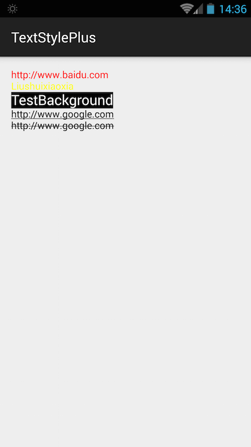

# TextStylePlus
android textview style

Ii's like [BabushkaText](https://github.com/quiqueqs/BabushkaText) or [Android-TextView-LinkBuilder](https://github.com/klinker24/Android-TextView-LinkBuilder)
# Demo

```
TextView textView = (TextView) findViewById(R.id.textview);

TextStyleItem one = new TextStyleItem("http://www.baidu.com");
one.setTextColor(Color.RED);
one.setClickListener(new TextStyleItem.OnClickListener() {
    @Override
    public void onClick(String clickedText) {
        Toast.makeText(MainActivity.this, "onClick", Toast.LENGTH_SHORT).show();
    }
});


TextStyleItem two = new TextStyleItem("Liushuixiaoxia");
two.setTextColor(Color.YELLOW);
two.setLongClickListener(new TextStyleItem.OnLongClickListener() {
    @Override
    public void onLongClick(String clickedText) {
        Toast.makeText(MainActivity.this, "onLongClick", Toast.LENGTH_SHORT).show();
    }
});

TextStyleItem three = new TextStyleItem("TestBackground");
three.setTextColor(Color.WHITE);
three.setBackgroundColor(Color.BLACK);
// three.setBackgroundColorRes(R.drawable.image_drawable);
three.setTextSize(Utils.dip2px(this, 20));
three.setLongClickListener(new TextStyleItem.OnLongClickListener() {
    @Override
    public void onLongClick(String clickedText) {
        Toast.makeText(MainActivity.this, "onLongClick", Toast.LENGTH_SHORT).show();
    }
});

TextStyleItem four = new TextStyleItem("http://www.google.com");
four.setUnderLined(true);

TextStyleItem five = new TextStyleItem("http://www.google.com");
five.setStrikethrough(true);

new StyleBuilder()
        .addStyleItem(one)
        .newLine()
        .addStyleItem(two)
        .newLine()
        .addStyleItem(three)
        .newLine()
        .addStyleItem(four)
        .newLine()
        .addStyleItem(five)
        .newLine()
        .show(textView);
```

